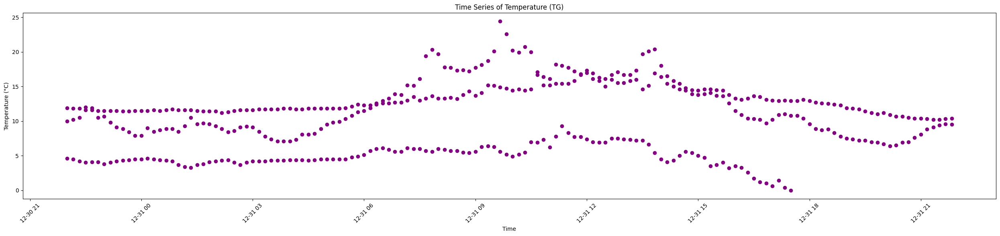
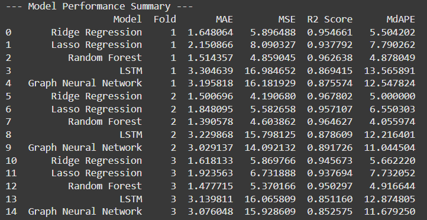

# **Weather Wiz**  
**Your AI-powered weather expert, trained on multi-station data to deliver precise and reliable forecasts.**

*by Noam Shabat & Tomer Vagenfeld*

## Abstract
This project presents Weather Wiz, an AI-powered system for forecasting temperature using 25 years of historical weather data provided by the Israel Meteorological Service (IMS). Employing a suite of machine learning models—from linear regressions with regularization to deep learning architectures such as LSTM and Graph Neural Networks (GNN)—the framework captures both temporal and spatial dependencies inherent in weather data. This document details the problem definition, data characteristics, preprocessing steps, model implementations, and experimental setup in a scientific paper format.

The following are samples of Meteorological stations which the data we extracted from IMS:

  


---


# 1. Introduction

### Problem Definition
The primary goal of this project is to predict temperature (denoted as **TG**) from historical meteorological data. Weather conditions are influenced by multiple factors, including humidity, wind speed, and precipitation. By leveraging 25 years of multi-station data sampled at 10-minute intervals (and aggregated appropriately), Weather Wiz aims to provide accurate short-term forecasts.

---

# 2. Data Description
These are the columns provided by IMS:

  


### Target: predict Ground Temperature (TG):

  


  


### Source and Nature of the Data
Data is sourced from the [Israel Meteorological Service (IMS)](https://ims.gov.il), which collects comprehensive weather measurements from stations across Israel. The dataset spans 25 years with observations recorded every 10 minutes. For forecasting purposes, the data is aggregated into hourly or daily templates as needed.

### Features and Labels
- **Features:**  
  - **Meteorological Variables:** Relative Humidity (RH), Wind Speed (WS), Wind Direction (WD), Rainfall (Rain), among others.  
  - **Engineered Features:**  
    - **Time Features:** Hour, sine, and cosine transformations of the hour to capture cyclic patterns.  
    - **Wind Vectors:** Derived from wind speed and wind direction to represent the wind’s x and y components.
- **Label:**  
  - **Temperature (TG):** The primary variable targeted for prediction.

---

# 3. Data Preprocessing and Preparation

### Preprocessing Steps
- **Data Cleaning:**  
  - Remove unrealistic values (e.g., ensure 0 ≤ RH ≤ 100, -15 ≤ TG ≤ 50).
  - Drop nulls in key variables.
- **Datetime Conversion:**  
  - Convert the `datetime` column into proper datetime objects and sort the data chronologically.
- **Scaling:**  
  - Apply `MinMaxScaler` to standardize the feature set.
- **Feature Engineering:**  
  - Generate cyclical features (e.g., `hour_sin` and `hour_cos`) by capturing diurnal cycles.
  - Compute wind vector components from wind speed and direction.

### Data Resolution and Splitting
- **Temporal Resolution:**  
  - Original data is recorded every 10 minutes; for forecasting, a sequence length is determined based on the desired forecast horizon (e.g., 6 intervals for hourly predictions, 144 for daily).
- **Time Series Split:**  
  - A custom time series split is implemented using `TimeSeriesSplit` to ensure that training and testing sets maintain chronological order. This split preserves the temporal integrity of the data.

---

# 4. Methodology

### Model Architectures

Weather Wiz implements a suite of models to capture diverse aspects of the data:

- **Linear Models:**  
  - **Linear Regression:**  
    Uses ordinary least squares to estimate model parameters by minimizing the sum of squared errors.  
  - **Ridge Regression:**  
    Incorporates L2 regularization to shrink coefficients, reducing overfitting by penalizing large weights.  
  - **Lasso Regression:**  
    Applies L1 regularization to enforce sparsity in the coefficients, effectively performing feature selection.

- **Tree-Based Model:**  
  - **Random Forest:**  
    Builds an ensemble of decision trees to capture nonlinear interactions among features. Its performance is further enhanced through targeted hyperparameter tuning.

- **Deep Learning Models:**  
  - **Long Short-Term Memory (LSTM):**  
    A recurrent neural network designed to capture long-term temporal dependencies in sequential data.  
  - **Graph Neural Network (GNN):**  
    Leverages graph structures to model spatial relationships among weather stations, improving forecasting accuracy by integrating both temporal and spatial contexts.

<hr style="border: 0; border-top: 1px solid #ccc;">

### Loss Function and Optimization

- **Loss Function:**  
  Deep learning models (LSTM and GNN) utilize the Mean Squared Error (MSE) loss for training.

- **Optimization Algorithms:**  
  - **LSTM:**  
    Trained using the Adam optimizer.
  - **GNN:**  
    Trained using the AdamW optimizer with weight decay for enhanced generalization.

- **Regularization Techniques:**  
  - **Ridge Regression:**  
    Uses L2 regularization.
  - **Lasso Regression:**  
    Uses L1 regularization.

- **Hyperparameter Tuning:**  
  - **LSTM:**  
    - Hidden units: 32 to 128  
    - LSTM layers: 2 (fixed)  
    - Dropout rate: 0.0 to 0.3  
    - Learning rate: 0.001 to 0.01  
    - Epochs: 5 to 10
      
  - **GNN:**  
    - Hidden dimension: 32 to 256  
    - Dropout: 0.0 to 0.5  
    - Learning rate: 0.001 to 0.01  
    - Epochs: 30 to 100
  - **Random Forest:**  
    Hyperparameter optimization was conducted on parameters such as the number of trees, maximum depth, and minimum sample split to best capture the nonlinear relationships in the data.

<hr style="border: 0; border-top: 1px solid #ccc;">

### Graph Neural Network (GNN) Overview

Graph Neural Networks (GNNs) model data as graphs where nodes represent weather stations and edges capture spatial or temporal relationships. By aggregating information from neighboring nodes through graph convolutional layers, GNNs effectively learn localized patterns—essential for accurate weather prediction when nearby conditions play a significant role.

#### Enhanced GNN Features

- **Architecture:**  
  - Constructed with three graph convolutional layers (GCNConv), each followed by batch normalization and LeakyReLU activations for stability and rapid convergence.
  - Residual connections between layers improve gradient flow, and dropout is applied to mitigate overfitting.
  - A final fully connected layer converts the aggregated node features into the final prediction.

- **Graph Data Construction:**  
  - **Sliding Window Concept:**  
    A sliding window approach is used to create sequential (temporal) edges by connecting each node to a set number of subsequent nodes. This design captures fine-grained temporal dynamics, providing rich context on how weather conditions evolve. The adjustable window size allows the model to adapt seamlessly to various forecasting horizons (e.g., hourly vs. daily).
  - **Unique Edge Option:**  
    Additionally, the model leverages station-specific geographical coordinates (latitude and longitude) to generate unique edges, enriching the graph by explicitly modeling spatial relationships among weather stations.

- **Training and Optimization:**  
  The GNN is trained using the AdamW optimizer with weight decay, enhancing generalization and preventing overfitting. Training and validation loss curves are continuously monitored to ensure robust performance.


---

# 5. Implementation Details

### Key Code Excerpts

### Long Short-Term Memory Network (LSTM) Model
The LSTM model is structured to capture the sequential nature of weather data:
```python
class WeatherForecastLSTM(nn.Module):
    def __init__(self, input_dim, hidden_units=32, lstm_layers=2, dropout_rate=0.0):
        """
        A simplified LSTM model with at least 2 layers.

        Parameters:
            input_dim (int): Number of input features.
            hidden_units (int): Number of hidden units.
            lstm_layers (int): Number of LSTM layers (default is 2).
            dropout_rate (float): Dropout rate (applied if lstm_layers > 1).
        """
        super(WeatherForecastLSTM, self).__init__()
        self.lstm = nn.LSTM(
            input_size=input_dim,
            hidden_size=hidden_units,
            num_layers=lstm_layers,
            dropout=dropout_rate if lstm_layers > 1 else 0,
            batch_first=True,
            bidirectional=False  # Single-direction for speed.
        )
        self.fc = nn.Linear(hidden_units, 1)

    def forward(self, x):
        lstm_out, _ = self.lstm(x)
        final_output = self.fc(lstm_out[:, -1, :])
        return final_output
```

### Graph Neural Network (GNN) Model
The GNN model is implemented to leverage spatial relationships:


```python
class GraphNeuralNetwork(nn.Module):
    def __init__(self, num_features, hidden_dim=128, dropout=0.3, negative_slope=0.01):
        """
        A robust GNN model that uses three GCNConv layers with residual connections.
        Batch normalization and LeakyReLU activations are applied for improved stability.
        """
        super(GraphNeuralNetwork, self).__init__()
        self.conv1 = GCNConv(num_features, hidden_dim)
        self.bn1 = nn.BatchNorm1d(hidden_dim)
        self.conv2 = GCNConv(hidden_dim, hidden_dim)
        self.bn2 = nn.BatchNorm1d(hidden_dim)
        self.conv3 = GCNConv(hidden_dim, hidden_dim)
        self.bn3 = nn.BatchNorm1d(hidden_dim)
        self.fc = nn.Linear(hidden_dim, 1)
        self.dropout = nn.Dropout(dropout)
        self.negative_slope = negative_slope

    def forward(self, x, edge_index):
        # First layer
        x1 = self.conv1(x, edge_index)
        x1 = self.bn1(x1)
        x1 = F.leaky_relu(x1, negative_slope=self.negative_slope)
        x1 = self.dropout(x1)

        # Second layer
        x2 = self.conv2(x1, edge_index)
        x2 = self.bn2(x2)
        x2 = F.leaky_relu(x2, negative_slope=self.negative_slope)
        x2 = self.dropout(x2)
        # Residual connection: add the output of the first layer to the second layer
        x2 = x2 + x1

        # Third layer
        x3 = self.conv3(x2, edge_index)
        x3 = self.bn3(x3)
        x3 = F.leaky_relu(x3, negative_slope=self.negative_slope)
        x3 = self.dropout(x3)
        # Residual connection: add the result from the previous block
        x3 = x3 + x2

        out = self.fc(x3)
        return out.squeeze()
```

---

# 6. Training Pipeline
#### Time Series Cross-Validation:
A custom time series split ensures that data is partitioned chronologically for robust evaluation.
Evaluation Metrics:
Models are assessed using Mean Absolute Error (MAE), Mean Squared Error (MSE), R² Score, and a modified Median Absolute Percentage Error (MdAPE).
Visualization:
The pipeline includes plots comparing actual vs. predicted values as well as training loss curves for each model.
6. Results
(Fill in detailed results and performance metrics after experimentation.)

### examples of results:

  
  

#### Linear Regression:		


#### Ridge Regression:		


#### Lasso Regression:		


#### Random Forest:			

 

#### LSTM(Long Short Term Memory Network):		
 
#### Graph Neural Network (GNN):		
 

- **Performance Metrics:**  
  - **MAE:**
     
     
  - **MSE:**
    
     
  - **R² Score:**
    
    

## Model Performance Summary

Below is an overview of the model performance metrics (MAE, MSE, R² Score, and MdAPE) across multiple folds:



---

# 7. Conclusion
Weather Wiz demonstrates a robust methodology for temperature prediction by combining classical statistical techniques with state-of-the-art deep learning models. The integration of both temporal and spatial features—particularly through the use of GNNs—allows the system to effectively model the complexities of weather dynamics. 
### Appendix
#### Additional Code and Utilities
The project repository includes further details on:

* querying the API of IMS
* Data cleaning and feature engineering routines.
* Custom time series splitting functions.
* Evaluation metrics and plotting utilities.
* Full implementation details for each model, including training loops and optimizer settings.

---

# 8. Getting Started

Ready to explore **Weather Wiz**? Follow these simple steps to set up and run the project locally:

### Clone the Repository

```bash
git clone https://github.com/Noamshabat1/WeatherWiz.git
cd WeatherWiz
```

### Set Up the Environment

Create and activate a virtual environment, then install the required dependencies:

```bash
python -m venv env
source env/bin/activate  # On Windows: env\Scripts\ctivate
pip install -r requirements.txt
```

### Data Path Configuration

**Important:** Before running the main script, update the data file path in `main.py` to match the location where you have saved your dataset. For example, you will see a line like:

```python
df = pd.read_csv('/path/to/your/data/FullData.csv')
```

### Run the Main Script

Launch the training pipeline:

```bash
python main.py
```

### Explore the Codebase

- **`data/`**: Data collection and preprocessing scripts.
- **`models/`**: Implementations of machine learning and deep learning models.
- **`training/`**: Training pipelines, evaluation metrics, and visualization scripts.
- **`notebooks/`**: Jupyter notebooks for exploratory analysis and experiments.

### Copy-Paste Commands

Simply copy the commands below into your terminal:

```bash
# Clone the repository
git clone https://github.com/Noamshabat1/WeatherWiz.git
cd WeatherWiz

# Create and activate a virtual environment
python -m venv env

# On macOS/Linux:
source env/bin/activate

# On Windows:
env\Scripts\activate

# Install dependencies
pip install -r requirements.txt

# Run the main training script
python main.py
```


Enjoy exploring **Weather Wiz** and happy forecasting!

---
  
## **Acknowledgments**  
This project is made possible with data from the [**Israel Meteorological Service (IMS)**](https://ims.gov.il).
